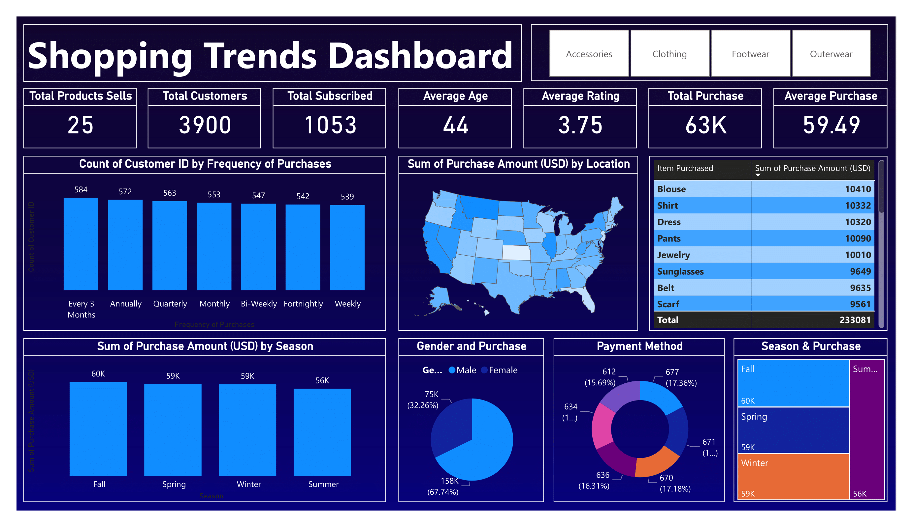

# Population Analysis

This Project created by Nisrag Bsc.Data

## Table of Contents
- [Screenshots](#screenshots)
- [Features](#features)
- [Installation](#installation)

## Screenshots

Include screenshots or images showcasing your project. Use relative paths for images inside your project.




## Features

🚀 Exciting News! 📊 Just launched a dynamic Power BI Dashboard showcasing key insights into our company's population data. 🌐 Here's a snapshot of the KPIs:
1️⃣ Total Products: 25 🛍️
2️⃣ Total Customers: 3900 🤝
3️⃣ Subscribed Customers: 1053 ✉️
4️⃣ Average Age of a Customer: 44 🎂
5️⃣ Average Customer Rating: ⭐ 3.75
6️⃣ Total Sales: 💲 63K (63000)
7️⃣ Average Sales: 💹 59.49
8️⃣ % Purchase by Males: 🧔 67.74%
9️⃣ % Purchase by Females: 👩 32.26%
🔟 Highest Item Purchased: 👚 Blouse
📈 Dive deep into the data to uncover trends, preferences, and opportunities for growth. The power of analytics at its best! 💡✨

## Installation

Provide instructions on how to install your project. You can include code snippets or commands.

```bash
npm install your-package-name
